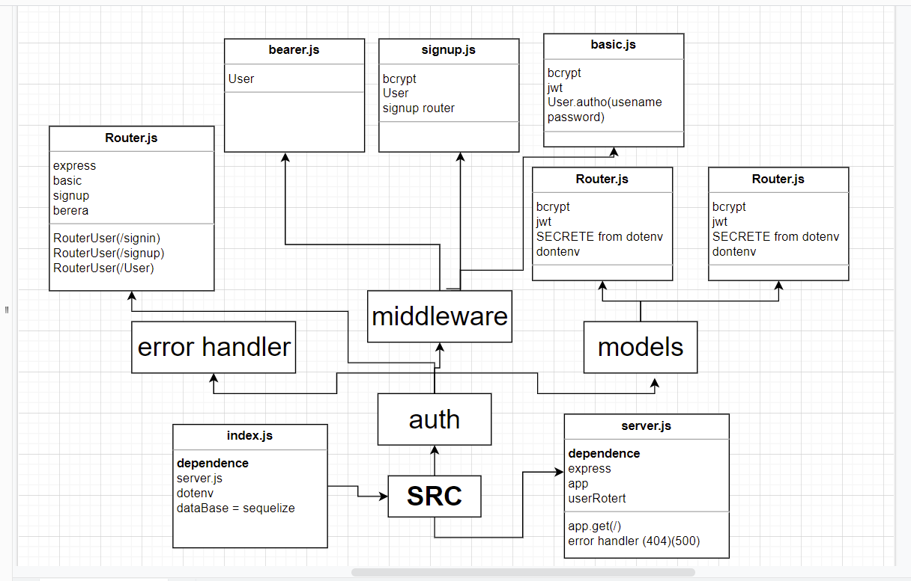

# bearer-auth

## UML

---
## URL

[Heroku](https://mohammad-bearer-auth.herokuapp.com/)

[Anions](https://github.com/Mohammad-Alhaj/bearer-auth/actions)

[Pull request](https://github.com/Mohammad-Alhaj/bearer-auth/pulls)

